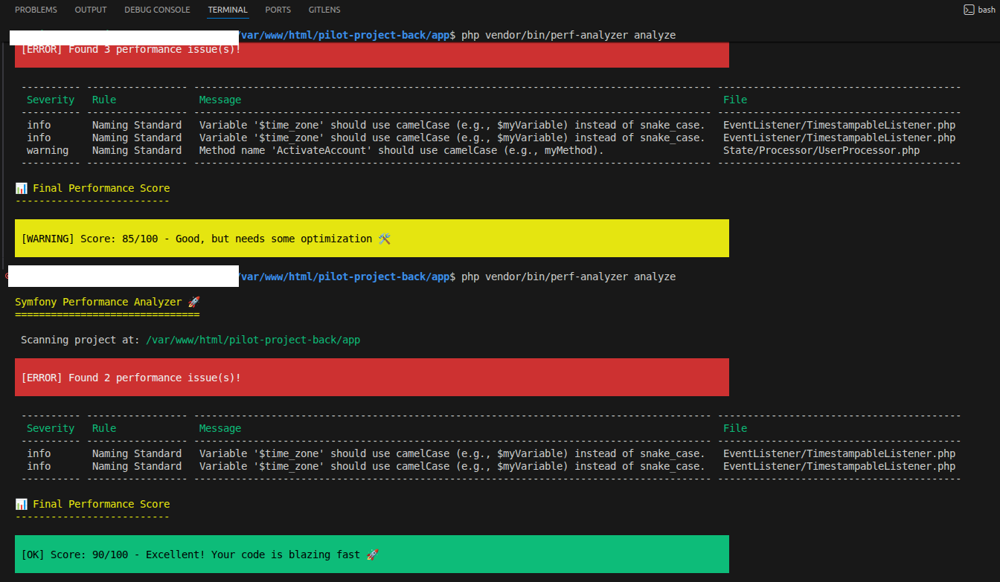

# 🚀 Symfony Performance Analyzer

[](https://packagist.org/packages/aghar/symfony-perf-analyzer)
[](https://github.com/aghar-saif-eddine/symfony-perf-analyzer/actions)
[](https://packagist.org/packages/aghar/symfony-perf-analyzer)
[](https://packagist.org/packages/aghar/symfony-perf-analyzer)
[](https://packagist.org/packages/aghar/symfony-perf-analyzer)

> *Symfony Performance Analyzer is a smart CLI tool that automatically scans your codebase to instantly detect performance bottlenecks like N+1 queries and risky debug configurations. By providing a clear performance score and actionable insights, it helps developers ship faster, production-ready applications with absolute confidence.*

---

### 📸 Analyzer in Action

---

## ✨ Features

* **🔍 N+1 Query Risk Detection:** Uses advanced Abstract Syntax Tree (AST) parsing via `nikic/php-parser` to catch Doctrine entities fetching relations inside loops (The silent performance killer).
* **🐢 Slow Query Scanner:** Analyzes the Symfony Profiler tokens to identify database queries exceeding 50ms without executing them.
* **⚙️ Production Config Check:** Ensures `APP_DEBUG` is not accidentally left enabled, preventing massive memory leaks in production environments.
* **📊 Gamified Scoring System:** Get a clear performance score (out of 100) to measure your app's health at a glance.
* **🤖 CI/CD & SaaS Ready:** Export results in JSON format to seamlessly integrate with GitHub Actions, GitLab CI, or your custom SaaS dashboards.

## 📦 Installation

You can install the package via composer. It is highly recommended to install it as a development dependency:

```bash
composer require --dev aghar/symfony-perf-analyzer
```
## 🚀 Usage
Run the analyzer directly from your terminal at the root of your Symfony project:
```bash
php vendor/bin/perf-analyzer analyze
```
(By default, it will scan the current directory and display a beautiful console output with your performance score).

#### 🔌 Custom Project Path
You can specify a different Symfony project path as an argument:

```bash
php vendor/bin/perf-analyzer analyze /path/to/your/symfony/project
```
## ⚙️ JSON Output (For CI/CD Pipelines)
If you want to parse the output in an automated CI pipeline or send it to an external SaaS dashboard, use the JSON format:

```bash 
php vendor/bin/perf-analyzer analyze --format=json
```

## 🏗️ Extensible Architecture
The analyzer is built with a clean, decoupled architecture making it easy to add new rules:

* src/Analyzer/Rules/: Contains the specific detection logic (AST traversing, regex, file scanning).

* src/Formatter/: Handles the output rendering (Console UI or strict JSON).

* src/Model/: Data structures representing violations and comprehensive reports.

## 🤝 Contributing
Pull requests are welcome. For major changes, please open an issue first to discuss what you would like to change.

## 📄 License
The MIT License (MIT).